本项目基于Java语言开发，从底层开始设计、编写RPC框架。

# 1. RPC架构设计

RPC（`remote procedure call`），远程调用，其简单流程如下：


**四个核心组件：**
- Server： 服务器
- Client：客户端
- Client Stub 就是将客户端请求的参数、服务名称、服务地址进行打包，统一发送给server方。
- Server Stub 用通俗易懂的语言来解释就是，服务端接收到Client发送的数据之后进行消息解包，调用本地方法。


大致调用流程如下：
发送服务请求 -> 包装 -> 解析 -> 服务器收到请求进行处理 -> 发回响应数据 -> 包装 -> 解析 -> 调用者收到数据


我们希望最终将此RPC框架包装成一个像方法一样可以直接调用的、屏蔽内部细节的“方法”，如：
```java
public class Client {

    public static void main(String[] args) {
        //调用一次远程服务
        // 1. 确定发给哪个服务器
        Server server = new Server("127.0.0.1",9999);
        // 2. 与之建立连接
        org.idea.irpc.framework.core.server.doConnect();
        // 3. 服务器发送响应数据
        Object sendResponse = org.idea.irpc.framework.core.server.doRef("sendSms","这是一条短信信息",10001);
        System.out.println(sendResponse);
    }
    
}
```
## 本RPC框架 架构图


- request：发送请求的客户端。
- provider：服务提供者。
- org.idea.irpc.framework.core.proxy：代理，使用代理模式，设置代理服务器，作为一个中介，降低系统耦合度。代理收到客户端发来的请求，转发给服务提供者。
- router：路由器，路由层根据内部规则确定将不同请求发给不同的服务提供者。
- protocol：协议层，router计算好需要调用的服务提供者的具体信息，将对应的地址信息、请求参数传输给protocol层，protocol层将数据封装成对应的协议体 -> 序列化 -> 传输给目标机器。
- filters：使用责任链模式，实现可插拔式组件设计与开发。
- registry：注册中心，用于管理集群服务器的各种信息。
- tolerant：容错层，出现异常时 统一交给容错层进行处理（超时重试/快速失败...）
- ThreadPool：服务器线程池，同步转异步处理。
- Spring Controller：接入层，接入到实际开发的项目中。
- org.idea.irpc.framework.core.common：公共层（图中没有），主要存放一些通用配置，工具类，缓存等信息。

# 2. 【前置知识】网络通讯模型核心
## 2.1 BIO技术(阻塞IO)
BIO demo：/predemo/demo1_BioAndNio/BioServer.java

服务端创建了socket之后会**堵塞在等待外界连接的accept函数环节**，当客户端连接上了服务端之后，accept的堵塞状态才会放开，然后进入read环节（读取客户端发送过来的网络数据）。


客户端如果一直没有发送数据过来，那么服务端的read调用方法就会一直处于堵塞状态，倘若数据通过网络抵达了网卡缓冲区，此时则会将数据从内核态拷贝至用户态，然后返回给read调用方。


如果客户端连接上服务器，但没发送数据，就会一直阻塞。

## 2.2 NIO(非阻塞IO)

### 改进方案一：使用多线程（线程池），客户端连接一次就开一个线程


但这种方式 在用户态层面调用的 read 函数依旧是堵塞的。

### 改进方案二：
在JDK的NIO模型中就有相关的设计【简单NIO服务器: /predemo/demo1_BioAndNio/NioSocketServer.java】


- `initServer()`： 打开一个ServerSocketChannel，将其设置为非阻塞模式
- `run()`：
1. 调用selector的select()方法
2. 获取到所有的处于就绪状态的channel，selectionKey中包含了channel的信息
3. 遍历selectionKey：
    - 就绪事件，处理连接 accept(key)：将当前的channel交给selector对象监管，并且由selector对象管理它的读事件
    - 读事件，处理数据读取 read(key)
    - 写事件，处理写数据

#### 每次请求都需要建立一个线程，如何优化？
将accept和read分成两个模块来处理，当accept函数接收到新的连接（其实本质就是一个文件描述符fd）之后，将其放入一个集合，然后会有一个后台任务统一对这个集合中的fd遍历执行read函数操作。


循环调用read方法会循环进行用户态和内核态的切换，频繁切换上下文也会影响性能。

### select/poll/epoll模型
> [select/poll/epoll模型视频讲解](https://www.bilibili.com/video/BV1qJ411w7du/?spm_id_from=333.337.search-card.all.click&vd_source=4e49ce85218facdc8b33777e905fe1dc)

- select

fd_set 使用数组实现  
1. fd_size 有限制 1024 bitmap
    `fd[i] = accept()`
2. fdset不可重用，新的fd进来，重新创建
3. 用户态和内核态拷贝产生开销
4. O(n)时间复杂度的轮询: 
成功调用返回结果大于 0，出错返回结果为 -1，超时返回结果为 0
具有超时时间
- poll
基于结构体存储fd
```
struct pollfd{
    int fd;
    short events;
    short revents; //可重用
}
```
解决了select的1,2两点缺点
- epoll
解决select的1，2，3，4
不需要轮询，时间复杂度为O(1)
  - epoll_create  创建一个白板 存放fd_events
  - epoll_ctl 用于向内核注册新的描述符或者是改变某个文件描述符的状态。已注册的描述符在内核中会被维护在一棵红黑树上
  - epoll_wait 通过回调函数内核会将 I/O 准备好的描述符加入到一个链表中管理，进程调用 epoll_wait() 便可以得到事件完成的描述符
      - 两种触发模式：
          - LT:水平触发
              当 epoll_wait() 检测到描述符事件到达时，将此事件通知进程，进程可以不立即处理该事件，下次调用 epoll_wait() 会再次通知进程。是默认的一种模式，并且同时支持 Blocking 和 No-Blocking。
          - ET:边缘触发
              和 LT 模式不同的是，通知之后进程必须立即处理事件。
              下次再调用 epoll_wait() 时不会再得到事件到达的通知。很大程度上减少了 epoll 事件被重复触发的次数，
              因此效率要比 LT 模式高。只支持 No-Blocking，以避免由于一个文件句柄的阻塞读/阻塞写操作把处理多个文件描述符的任务饿死。

# 3. 开发实战一：代理层（Stub）
基于Netty搭建了一套简单的服务端和客户端通信模型。


**开发图中stub处理的逻辑：**

**【通过自定义协议体RpcProtocol的方式来解决网络粘包和拆包的问题。】**
- RpcEncoder 编码器
  - 【2字节的magic number + 包体的4个字节 + content字节数据】直接塞到ByteBuf中进行发送
- RpcDecoder 解码器
  - 服务器不断将收到的客户端的字节流数据放到ByteBuf这个字节数组容器中，
      * 考虑到有粘包(多个包一起发送了)和半包(1个包被分成了多部分发送)，需要记录初始的readerIndex，
        * 后面判断如果解析不出来一个完整的数据包，则读取指针归位即可，没有收到一个完整的数据包时，下一个ServerHandler中的Object msg也不会有东西。
        * 否则就是截取出一个完整的客户端数据包，收到了一个完整的数据包，则强转为RpcProtocol，就可以进行业务处理了。同时移动了readerIndex指针，等待不断地收取数据截取下一个数据包。

- Server
    1. 注入配置类，设置端口号
    2. 注册服务，注入实现类：将注册的对象放在一个共享MAP集合（缓存）中统一管理
    3. 启动服务：
        - boostrap设置bossGroup、workerGroup
        - 设置通道为非阻塞通道
        - 初始化provider，管道中加入RpcEncoder、RpcDecoder、ServerHandler
- Client 
  1. 注入配置类，设置端口号
  2. 发送服务请求：
     1. 管道初始化编解码器和客户端响应类
     2. 链接netty客户端
     3. 注入代理工厂
        1.  `JDKClientInvocationHandler`： 注入一个uuid，对每一次的请求都做单独区分；将请求的参数放入到发送队列中
        2.  `JavassistInvocationHandler`

## 整体流程：
1. Server启动，将服务注册到服务器的PROVIDER_CLASS_MAP中统一管理
2. Client启动，注入代理工厂（代理工厂根据配置信息找到对应的代理工厂实现类xxxProxyFactory）
3. Client调用get方法，向代理工厂传入需要的Service接口，创建出一个动态代理对象（当调用service的方法时，就会调用代理对象的invoke方法）。
4. Client调用service接口方法service.methodXX(args)，代理对象的invocationHandler执行invoke方法， 将传来的参数args包装进RpcInvocation里，设置一个标识请求的UUID，然后将<UUID,NULL>放入响应map里等待回复。 再将请求参数放入到发送队列。
5. Client进入阻塞等待：RESP_MAP.get()，RESP_MAP是一个ConcurrentHashMap。
6. 发送队列是一个阻塞队列，当其非空时会唤醒Client的异步阻塞线程，从发送队列中取出一个RpcInvocation，包装成RpcProtocol，通过netty通道发送到服务端。
7. Server的Decoder接收到数据，将其解码为RpcProtocol格式的消息，传送给ServerHandler，ServerHandler再从中获得RpcInvocation（`rpcProtocol.getContent()`）。
8. Server获取RpcInvocation中所需的服务名称和所需方法，通过反射，找到所需方法，执行目标方法（同样是调用方法对象的invoke方法）并返回对应值。
9. Server获得目标方法的返回值后，将其设置进RpcInvocation的response里，再次包装为RpcProtocol，写出通道，交给代理类的Encoder，编码后发还给Client。
10. Client在规定时间内接收到数据（RESP_MAP中可以取出数据了），如果根据对应uuid找到的数据是RpcInvocation实例，将其强转成RpcInvocation并返回其中的response。

# 4. 开发实战二： 注册中心的接入与实现
## 4.1 下载并启动Zookeeper
[Zookeeper 入门](https://zhuanlan.zhihu.com/p/158986527)

ZooKeeper是一个分布式服务协调框架，提供了分布式数据一致性的解决方案，基于ZooKeeper的数据结构，Watcher，选举机制等特点，可以实现数据的发布/订阅，软负载均衡，命名服务，统一配置管理，分布式锁，集群管理等等。

**ZooKeeper能保证：**
- 更新请求顺序进行。来自同一个client的更新请求按其发送顺序依次执行
- 数据更新原子性。一次数据更新要么成功，要么失败 
- 全局唯一数据视图。client无论连接到哪个server，数据视图都是一致的 
- 实时性。在一定时间范围内，client读到的数据是最新的

ZooKeeper的数据结构和Unix文件系统很类似，总体上可以看做是一棵树，每一个节点称之为一个ZNode，每一个ZNode默认能存储1M的数据。每一个ZNode可通过唯一的路径标识。如下图所示：

## 监听通知机制
Watcher是基于观察者模式实现的一种机制。如果我们需要实现当某个ZNode节点发生变化时收到通知，就可以使用Watcher监听器。
客户端通过设置监视点（watcher）向 ZooKeeper 注册需要接收通知的 znode，在 znode 发生变化时 ZooKeeper 就会向客户端发送消息。
这种通知机制是一次性的。一旦watcher被触发，ZooKeeper就会从相应的存储中删除。如果需要不断监听ZNode的变化，可以在收到通知后再设置新的watcher注册到ZooKeeper。
监视点的类型有很多，如监控ZNode数据变化、监控ZNode子节点变化、监控ZNode 创建或删除。

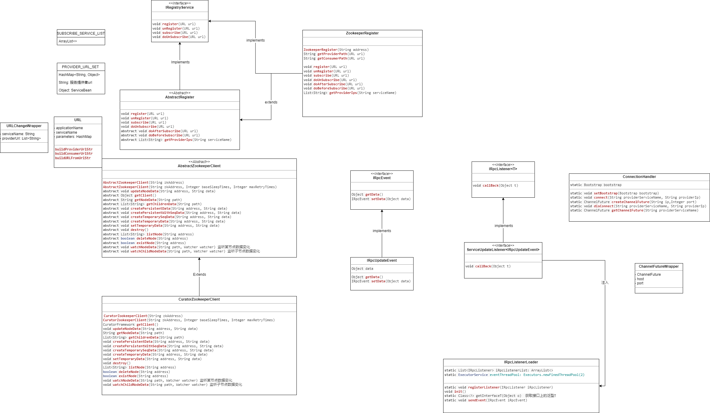

## 4.2 整体流程
- Server：
  - initServerConfig()：从文件中读取ServerConfig，初始化Server
  - exportService(Object serviceBean)：传入ServiceBean实现类，向外暴露服务
    - 将该类的第一个接口作为接口名，放入PROVIDER_CLASS_MAP(interface name -> serviceBean)
    - 将服务提供者的host、port、serviceName、applicationName包装进自定义URL类，加入 PROVIDER_URL_SET
  - batchExportUrl()：将服务端的具体服务暴露到注册中心，对PROVIDER_URL_SET中的URL逐个注册到注册中心
- Client：
  - 启动客户端。初始化iRpcListenerLoader。
  - doSubscribeService(Class serviceBean)：开启服务之前需要预先订阅对应的服务
    - doAfterSubscribe(URL url)：客户端订阅后，监听是否有新的服务注册
      - 监听"{ROOT}/{serviceName}/provider"的孩子节点数据 watchChildNodeData(newServerNodePath)
          - zkClient.watchChildNodeData(provider的path, Watcher)
              - 重写传入watcher的process方法process(WatchedEvent watchedEvent)
                  - 使用自定义的监听组件 `IRpcEvent iRpcEvent = new IRpcUpdateEvent(urlChangeWrapper)`
                    - `IRpcListenerLoader.sendEvent(iRpcEvent)`
                      - IRpcListenerLoader 初始化时（Client初始化时调用了init()）就会注册一个服务更新监听器ServiceUpdateListener，将其加入静态的iRpcListenerList里
                        - 这个监听器的回调方法会移除老的url，加入新的url。
                      - `sendEvent(IRpcEvent iRpcEvent)`，会遍历iRpcListenerList，如果有符合传入的事件的监听器的泛型，就会调用这个监听器的回调方法（即触发更新事件）。
- ZookeeperRegister （extends AbstractRegister implements RegistryService）:
  - register: 
    - 如果zkClient中没有ROOT节点，创建该节点
    - 将传进来的url分别构造成providerPath（"{ROOT}/{serviceName}/provider/{host}:{port}"）, consumerPath（"{ROOT}/{serviceName}/consumer/{host}:"）
    - 如果zkClient中已经有providerPath，先将其删除；如果没有providerPath，创建临时节点数据，并把consumerPath作为数据放进去
    - 将url放入PROVIDER_URL_SET
  - unregister：
    - 在zkClient中删除providerPath节点
    - 将url从PROVIDER_URL_SET移除

# 5. 开发实战三：路由层（Router）
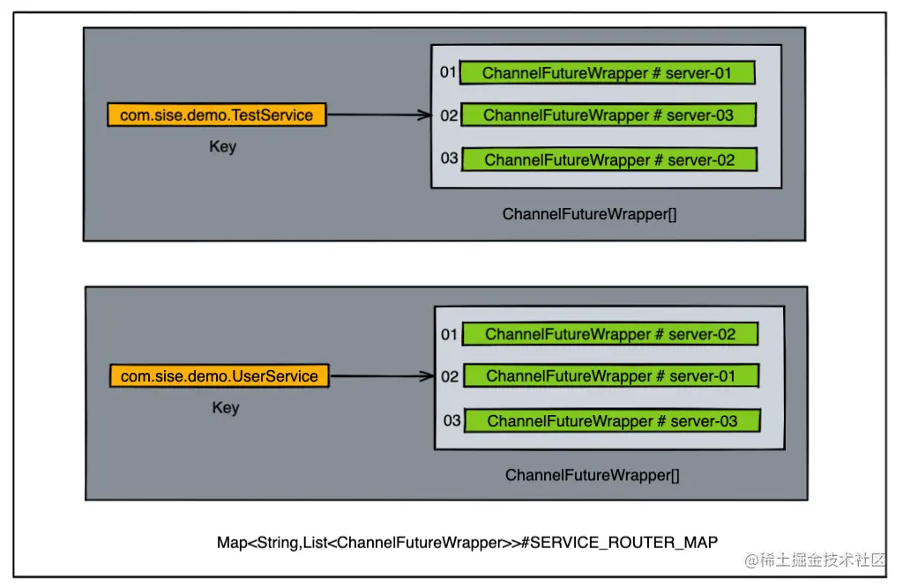
同一个服务可能对应着多个服务提供者，因此当客户端请求服务时，需要通过负载均衡策略从中选择一个合适的服务提供者

之前的设计思路为：从多个**连接**（ChannelFuture通道）中随机选择一个，进行网络通信

```java
ChannelFuture channelFuture = channelFutureWrappers.get(new Random().nextInt(channelFutureWrappers.size())).getChannelFuture();
```

引入路由层，可以自定义负载均衡策略进行优化。

基于 `SERVICE_ROUTER_MAP` 实现

-   key为服务提供者名字，value为对应的连接数组

```
key -> ProviderServiceName: String
value -> ChannelFutureWrapper[]: Array
```

## 带权重的随机选取策略

自定义随机选取逻辑，将转化后的连接数组存入 SERVICE_ROUTER_MAP 中

虽然是随机选取，但是权重值越大，被选取的次数也会越多

默认初始情况下weight值为100

## 轮询策略

直接按照添加的先后顺序获取连接，将转化后的连接数组存入 SERVICE_ROUTER_MAP 中

###获取连接实现

ChannelFuturePollingRef为实现类，用于从SERVICE_ROUTER_MAP中根据服务提供者名字轮询获取连接

本质是通过原子类取模运算获取连接

```java
private AtomicLong referenceTimes = new AtomicLong(0);

public ChannelFutureWrapper getChannelFutureWrapper(String serviceName) {
    ChannelFutureWrapper[] arr = SERVICE_ROUTER_MAP.get(serviceName);
    long i = referenceTimes.getAndIncrement();
    int index = (int) (i % arr.length);
    return arr[index];
}
```

## 权重更新事件

每个服务提供者在注册服务时默认的权重初始值为100。当该值被修改后，触发权重更新事件，修改对应的 SERVICE_ROUTER_MAP

该更新事件也是通过Watcher与自定义的监听事件机制实现.

## 常见的负载均衡算法
除了随机和轮训算法之外，常见的负载均衡算法有以下几种：

- 最小连接数
最小连接数负载均衡算法需要记录每个应用服务器正在处理的连接数，然后将新来的请求转发到最少的那台上。但是对于每台服务器的请求量都需要做记录并且上报到一个固定的位置，并且通知到客户端每台目标服务器当前的连接数状态，实现起来会比较复杂。
- 分布式哈希的一致性
分布式哈希的一致性算法在实际使用的时候可能会出现“哈希倾斜” 的问题，为了解决这类问题，通常在算法的内部会设计一些虚拟节点的存在，从而平衡请求的均匀性。
- ip的hash算法
ip的hash算法通常是将源地址通过hash计算，定位到具体的一台机器上。但是如果一旦某台机器出现奔溃的话，该ip的请求就会直接崩溃，对于容错性来说不强。

# 6. 开发实战四：序列化
RpcProtocol和RpcInvocation两者之间的关系设计大概如下所示：
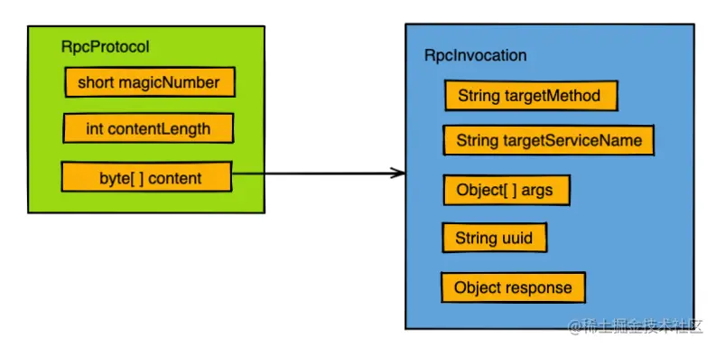

如何将RpcInvocation对象转换为byte数组？
四种序列化方案：
- Jdk
- Hessian
- Kryo
- FastJson

## 性能对比
**性能指标：**
1. 产生的码流大小；
2. 序列化处理的速度

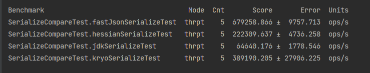

ps：网上的主流答案是kryo>hessian>fastjson>jdk

# 7. 开发实战五：责任链模式
1. 对client的请求做鉴权：请求抵达服务端调用具体方法之前，先对其调用凭证进行判断操作，如果凭证不一致则抛出异常。

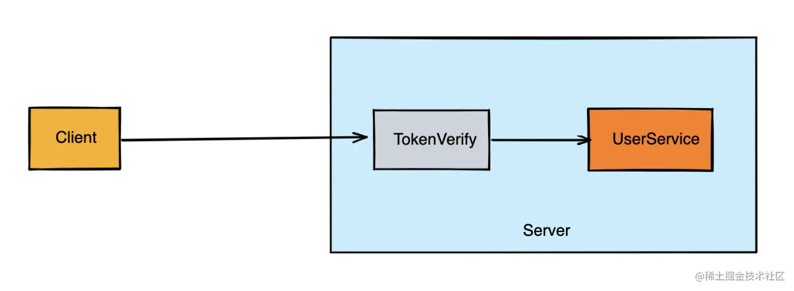
2. 分组管理服务：如果我们将服务按照组别进行管理，A开发的UserService的group设置为dev，B开发的UserService的group设置为test，而远程调用的时候严格遵守group参数进行匹配调用，这样就能确保测试同学在调用服务的时候，不会将请求路由到A同学所写的还未完善的UserService上边了。

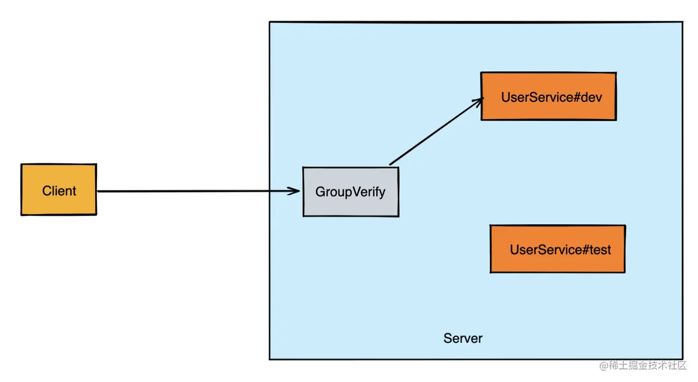
3. 如何实现基于ip直连的方式访问server端？
按照指定ip访问的方式请求server端是我们在测试阶段会比较常见的方式，例如服务部署之后，发现2个名字相同的服务，面对相同的请求参数，在两个服务节点中返回的结果却不一样，此时就可以通过指定请求ip来进行debug诊断。

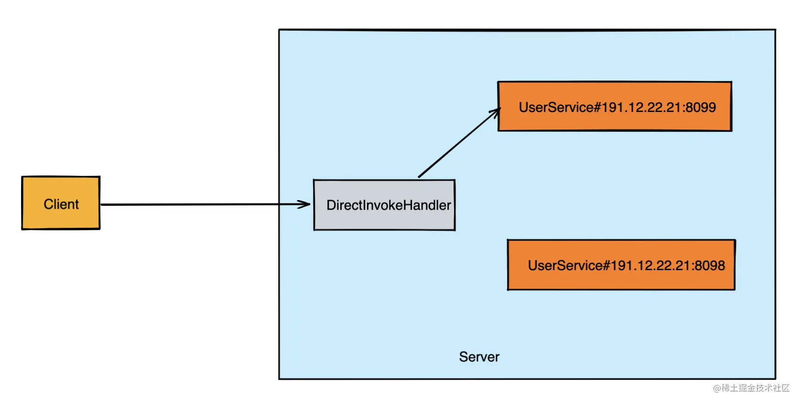
4. 调用过程中需要记录下调用的相关日志信息

每次请求都最好能有一次请求调用的记录，方便开发者调试。日志的内容一般会关注以下几个点：调用方信息，请求的具体服务的哪个方法，请求时间。

## 责任链模式
在责任链模式中，客户只需要将请求发送到责任链上即可，无须关心请求的处理细节和请求的传递过程，所以责任链将请求的发送者和请求的处理者解耦了。

**使用责任链设计模式的好处：**
- 发送者与接收方的处理对象类之间解耦。
- 封装每个处理对象，处理类的最小封装原则。
- 可以任意添加处理对象，调整处理对象之间的顺序，提高了维护性和可拓展性，可以根据需求新增处理类，满足开闭原则。
- 增强了对象职责指派的灵活性，当流程发生变化的时候，可以动态地改变链内的调动次序可动态的新增或者删除。
- 责任链简化了对象之间的连接。每个对象只需保持一个指向其后继者的引用，不需保持其他所有处理者的引用，这避免了使用众多的 if 或者 if···else 语句。
- 责任分担。每个类只需要处理自己该处理的工作，不该处理的传递给下一个对象完成，明确各类的责任范围，符合类的单一职责原则。

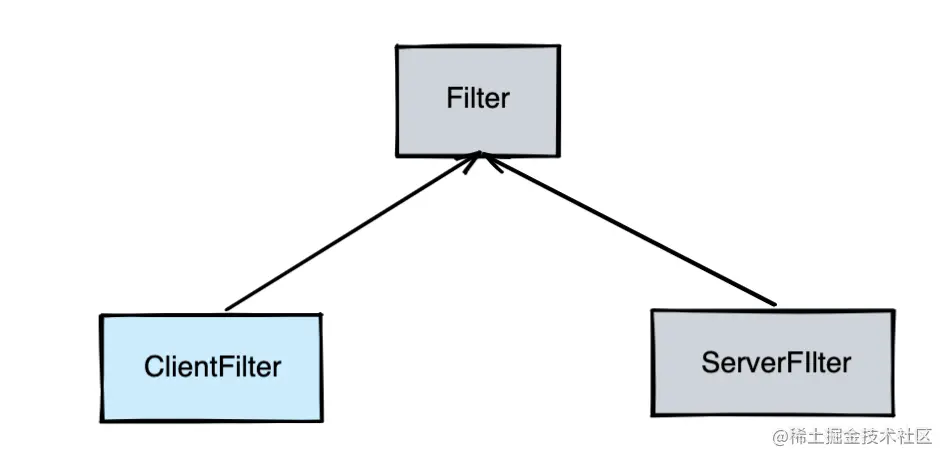


服务端token鉴权：目前只是基于一个简单的Map做判断依据，大致的存储关系如下图所示，可以看到这块的鉴权目前主要只是细粒度到接口级别，还没有精确到方法级别。

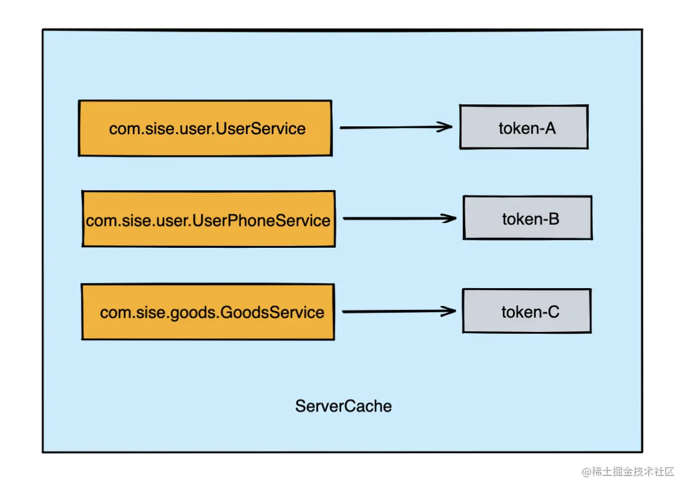

## Server:
main 
```java
        ServiceWrapper dataServiceServiceWrapper = new ServiceWrapper(new DataServiceImpl(), "dev");
        dataServiceServiceWrapper.setServiceToken("token-a");
        dataServiceServiceWrapper.setLimit(2);
        ServiceWrapper userServiceServiceWrapper = new ServiceWrapper(new UserServiceImpl(), "dev");
        userServiceServiceWrapper.setServiceToken("token-b");
        userServiceServiceWrapper.setLimit(2);
        
        server.exportService(dataServiceServiceWrapper);
        server.exportService(userServiceServiceWrapper);
```
initServerConfig()

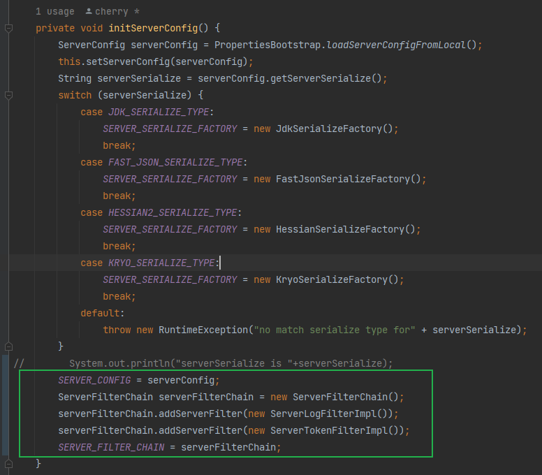

ServerHandler

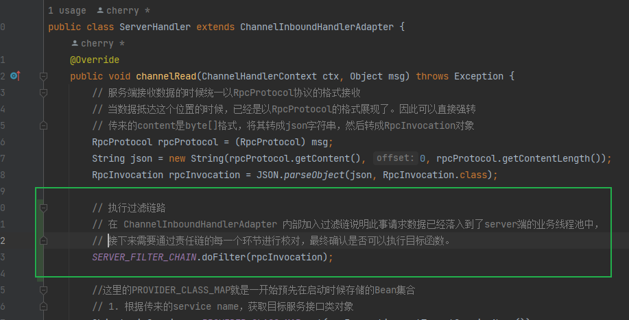

## Client

Client.initClientConfig()

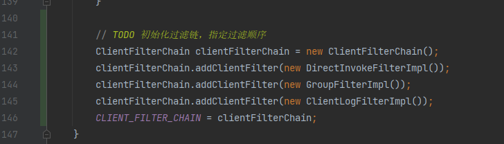

ConnectionHandler

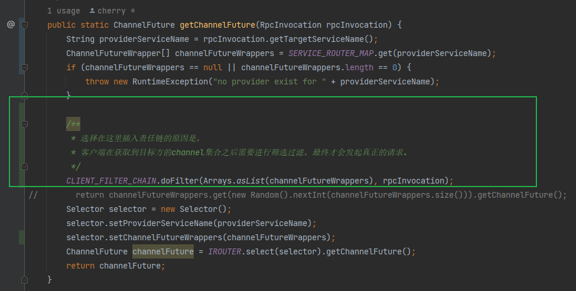


# 8. 开发实战六：SPI机制实现可插拔式组件
SPI 的全称叫做：Service Provider Interface，它是一种通过外界配置来加载具体代码内容的技术手段。
常见的实现思路是：在统一规定的文件目录底下，新建一份文件，并在该文件内部定义好需要加载的类，让核心程序在不做内部源代码修改的条件下可以引入执行的代码逻辑。

JDK内置提供的ServiceLoader会自动帮助我们去加载/META-INF/services/目录下边的文件，并且将其转换为具体实现类。
org.idea.irpc.framework.core.spi.jdk.ISpiTest

JDK内部的ServiceLoader加载流程大致为：
* 调用load函数
* ->再调用到reload方法， 并且在reload方法里面触发一个叫做LazyIterator的类， 这个类实现了迭代器的Iterator接口。
  
```java
public void reload() {
     providers.clear();
     lookupIterator = new LazyIterator(service, loader);
}
```

当外界使用SPI迭代器的时候会触发到iterator函数，于是最终便会触发到了java.util.ServiceLoader.LazyIterator#hasNextService内部，这里头会将spi配置文件的内容加载到内存，但是此时还没有触发到class对象的初始化。

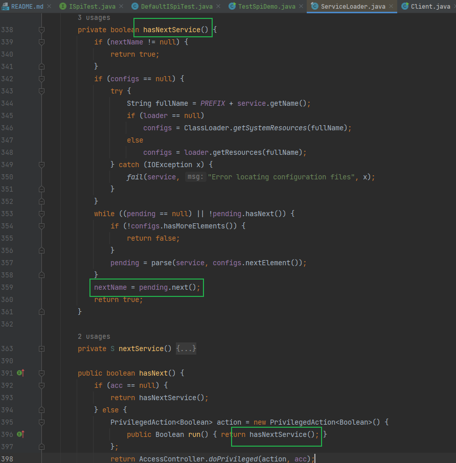


当测试程序执行到了：ISpiTest iSpiTest = iSpiTestIterator.next();这一部分内容的时候才会触发到具体的类实例化。下图是JDK1.8内部的源代码，位置在java.util.ServiceLoader.LazyIterator#nextService中。

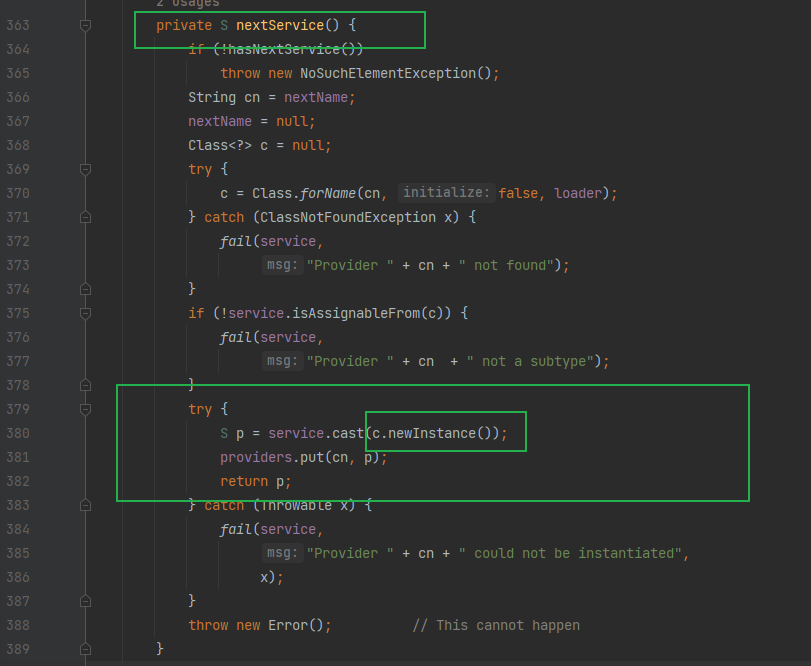

当年JDK内置了SPI机制之后，一些数据库驱动包便开始广泛采用了此类技术。例如MySQL的链接驱动包中便采用了这类设计。

虽然看起来这套SPI机制使用会比较方便，但是依然存在一些问题：
1. 在 META-INF/service 下的配置中如果存在 N个实现类，采用JDK自带的SPI机制会一次性将它们进行初始化加载。在加载的过程中如果涉及到了一些比较耗时的操作，会非常浪费资源。
2. 如果扩展点加载失败，会导致调用方报错，而且这个错误很难定位到是这个原因 。

除了实例化延迟之外，在SPI的配置文件规则方面借鉴了Dubbo内部的key-value设计风格。key是我们可以在外界对irpc.properties配置文件中所指定的关键字，而value则是对应的接口实现类名称。


# 9. 提高系统并发承载能力

当前系统：
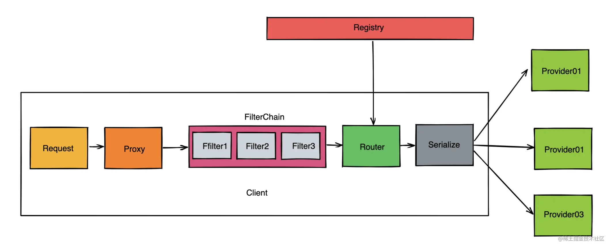

当前我们的org.idea.irpc.framework.core.server.ServerHandler类存在着一个重大的性能瓶颈问题，那就是一旦出现堵塞，将会影响其他服务的远程调用。

为了尽量避免出现请求堵塞，我们可以尝试采用异步消费的思路来解决这种问题。

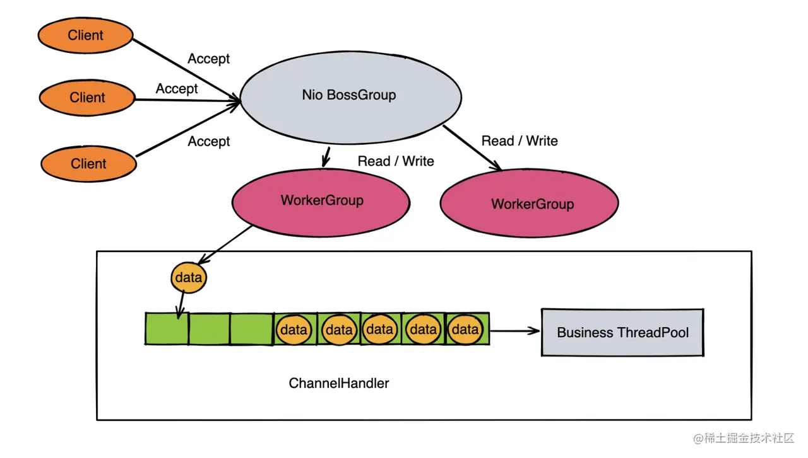

# 10. 容错层
场景：
服务端异常返回给到调用方展示 ；
客户端调用可以支持超时重试 ；
服务提供方进行接口限流 。

1. 服务端异常返回给客户端，方便排查。

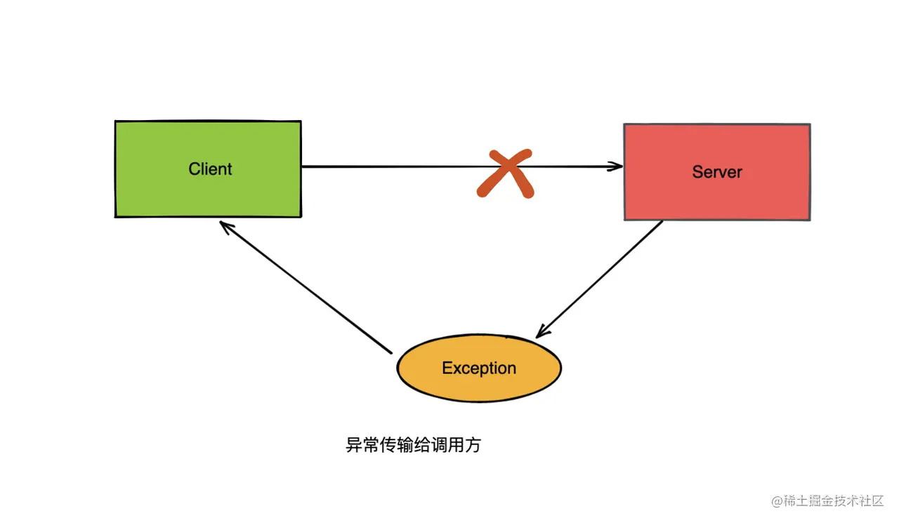

2. 超时重试机制

并不是所有的接口在超时的时候都需要进行重试，面对一些非幂等性的接口调用情况，重试机制就应该谨慎使用。

3. 服务端保护机制

在微服务集群的互相调用过程中，通常服务的消费方会比服务的提供方要多得多，所以合理的设置流量阈值是可以对服务提供方产生保护效果的。

**该从哪些点进行保护？**
1. 控制业务应用整体的连接上限；
2. 单个服务请求的限流。

使用tryAcquire则是一种“快速响应”的解决思路，当获取申请失败后，不会堵塞当前线程，而是立马通知客户端调用异常，然后发起二次重试，路由到其他节点。至少这种策略相比于acquire来说不存在请求堆积，导致服务崩溃的风险因素。


# Reference
1. 本笔记（包括笔记中的多数图片）自[Java开发者的RPC实战课](https://juejin.cn/book/7047357110337667076/section/7047522878673125415?enter_from=course_center)及其评论区
【侵删】
2. [select/poll/epoll模型视频讲](https://www.bilibili.com/video/BV1qJ411w7du/?spm_id_from=333.337.search-card.all.click&vd_source=4e49ce85218facdc8b33777e905fe1dc)
3. [Zookeeper 入门](https://zhuanlan.zhihu.com/p/158986527)