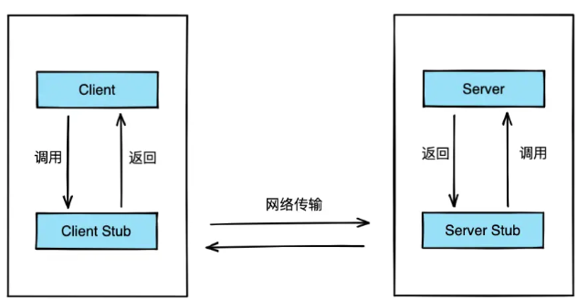
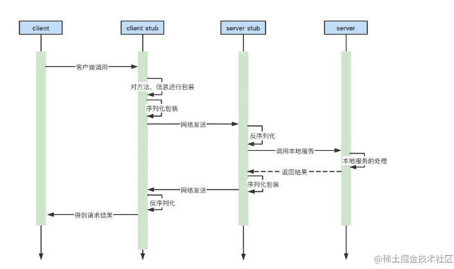
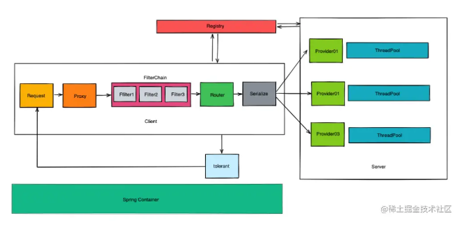
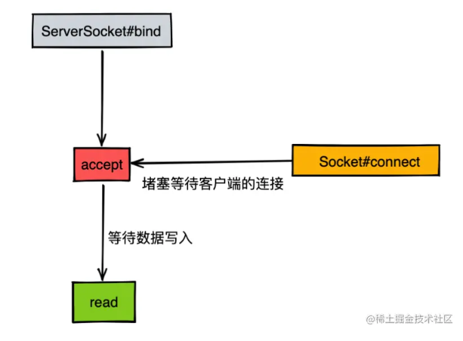
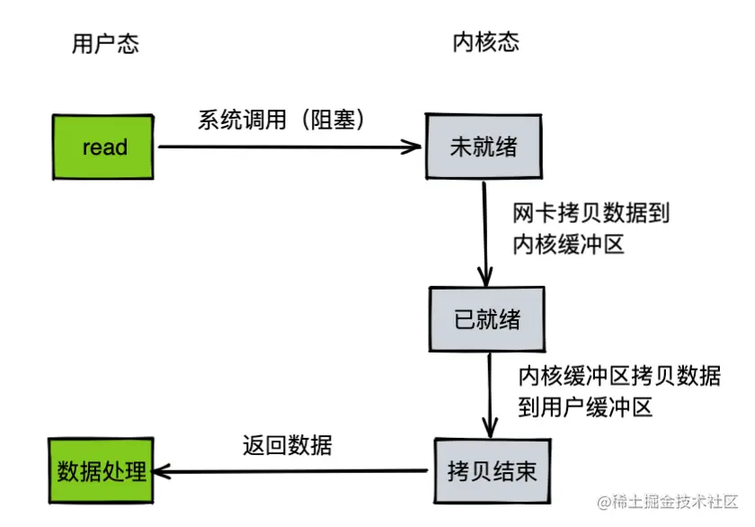
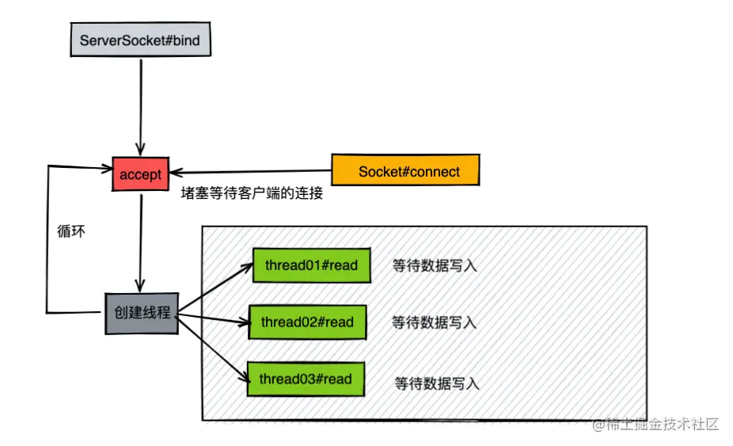
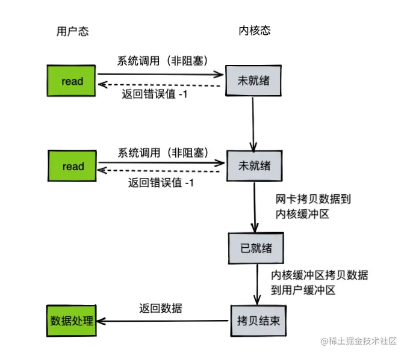
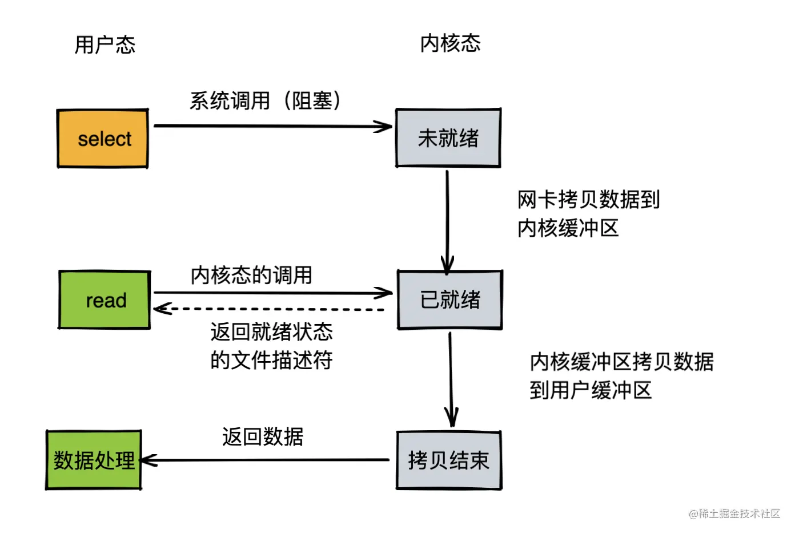
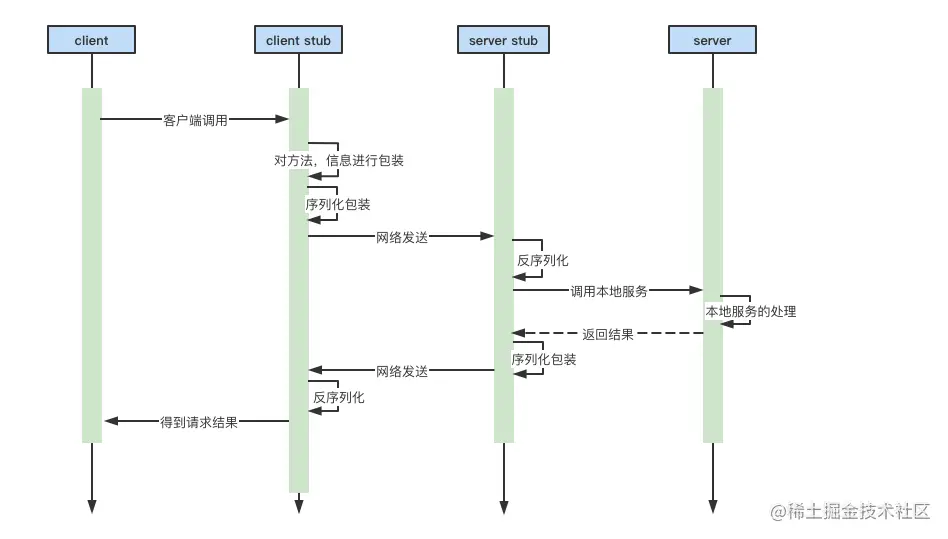

本项目基于Java语言开发，从底层开始设计、编写RPC框架。

# 1. RPC架构设计

RPC（`remote procedure call`），远程调用，其简单流程如下：


**四个核心组件：**
- Server： 服务器
- Client：客户端
- Client Stub 就是将客户端请求的参数、服务名称、服务地址进行打包，统一发送给server方。
- Server Stub 用通俗易懂的语言来解释就是，服务端接收到Client发送的数据之后进行消息解包，调用本地方法。



大致调用流程如下：
发送服务请求 -> 包装 -> 解析 -> 服务器收到请求进行处理 -> 发回响应数据 -> 包装 -> 解析 -> 调用者收到数据


我们希望最终将此RPC框架包装成一个像方法一样可以直接调用的、屏蔽内部细节的“方法”，如：
```java
public class Client {

    public static void main(String[] args) {
        //调用一次远程服务
        // 1. 确定发给哪个服务器
        Server server = new Server("127.0.0.1",9999);
        // 2. 与之建立连接
        server.doConnect();
        // 3. 服务器发送响应数据
        Object sendResponse = server.doRef("sendSms","这是一条短信信息",10001);
        System.out.println(sendResponse);
    }
    
}
```
## 本RPC框架 架构图


- request：发送请求的客户端。
- provider：服务提供者。
- proxy：代理，使用代理模式，设置代理服务器，作为一个中介，降低系统耦合度。代理收到客户端发来的请求，转发给服务提供者。
- router：路由器，路由层根据内部规则确定将不同请求发给不同的服务提供者。
- protocol：协议层，router计算好需要调用的服务提供者的具体信息，将对应的地址信息、请求参数传输给protocol层，protocol层将数据封装成对应的协议体 -> 序列化 -> 传输给目标机器。
- filters：使用责任链模式，实现可插拔式组件设计与开发。
- registry：注册中心，用于管理集群服务器的各种信息。
- tolerant：容错层，出现异常时 统一交给容错层进行处理（超时重试/快速失败...）
- ThreadPool：服务器线程池，同步转异步处理。
- Spring Controller：接入层，接入到实际开发的项目中。
- common：公共层（图中没有），主要存放一些通用配置，工具类，缓存等信息。

# 2. 【前置知识】网络通讯模型核心
## 2.1 BIO技术(阻塞IO)
BIO demo：/predemo/demo1_BioAndNio/BioServer.java

服务端创建了socket之后会**堵塞在等待外界连接的accept函数环节**，当客户端连接上了服务端之后，accept的堵塞状态才会放开，然后进入read环节（读取客户端发送过来的网络数据）。


客户端如果一直没有发送数据过来，那么服务端的read调用方法就会一直处于堵塞状态，倘若数据通过网络抵达了网卡缓冲区，此时则会将数据从内核态拷贝至用户态，然后返回给read调用方。


如果客户端连接上服务器，但没发送数据，就会一直阻塞。

## 2.2 NIO(非阻塞IO)

### 改进方案一：使用多线程（线程池），客户端连接一次就开一个线程


但这种方式 在用户态层面调用的 read 函数依旧是堵塞的。

### 改进方案二：
在JDK的NIO模型中就有相关的设计【简单NIO服务器: /predemo/demo1_BioAndNio/NioSocketServer.java】

- `initServer()`： 打开一个ServerSocketChannel，将其设置为非阻塞模式
- `run()`：
1. 调用selector的select()方法
2. 获取到所有的处于就绪状态的channel，selectionKey中包含了channel的信息
3. 遍历selectionKey：
    - 就绪事件，处理连接 accept(key)：将当前的channel交给selector对象监管，并且由selector对象管理它的读事件
    - 读事件，处理数据读取 read(key)
    - 写事件，处理写数据

#### 每次请求都需要建立一个线程，如何优化？
将accept和read分成两个模块来处理，当accept函数接收到新的连接（其实本质就是一个文件描述符fd）之后，将其放入一个集合，然后会有一个后台任务统一对这个集合中的fd遍历执行read函数操作。


循环调用read方法会循环进行用户态和内核态的切换，频繁切换上下文也会影响性能。

### select/poll/epoll模型
> [select/poll/epoll模型视频讲解](https://www.bilibili.com/video/BV1qJ411w7du/?spm_id_from=333.337.search-card.all.click&vd_source=4e49ce85218facdc8b33777e905fe1dc)
- select

fd_set 使用数组实现  
1. fd_size 有限制 1024 bitmap
    `fd[i] = accept()`
2. fdset不可重用，新的fd进来，重新创建
3. 用户态和内核态拷贝产生开销
4. O(n)时间复杂度的轮询: 
成功调用返回结果大于 0，出错返回结果为 -1，超时返回结果为 0
具有超时时间
- poll
基于结构体存储fd
```
struct pollfd{
    int fd;
    short events;
    short revents; //可重用
}
```
解决了select的1,2两点缺点
- epoll
解决select的1，2，3，4
不需要轮询，时间复杂度为O(1)
  - epoll_create  创建一个白板 存放fd_events
  - epoll_ctl 用于向内核注册新的描述符或者是改变某个文件描述符的状态。已注册的描述符在内核中会被维护在一棵红黑树上
  - epoll_wait 通过回调函数内核会将 I/O 准备好的描述符加入到一个链表中管理，进程调用 epoll_wait() 便可以得到事件完成的描述符
      - 两种触发模式：
          - LT:水平触发
              当 epoll_wait() 检测到描述符事件到达时，将此事件通知进程，进程可以不立即处理该事件，下次调用 epoll_wait() 会再次通知进程。是默认的一种模式，并且同时支持 Blocking 和 No-Blocking。
          - ET:边缘触发
              和 LT 模式不同的是，通知之后进程必须立即处理事件。
              下次再调用 epoll_wait() 时不会再得到事件到达的通知。很大程度上减少了 epoll 事件被重复触发的次数，
              因此效率要比 LT 模式高。只支持 No-Blocking，以避免由于一个文件句柄的阻塞读/阻塞写操作把处理多个文件描述符的任务饿死。

# 3. 开发实战一：代理层（Stub）
基于Netty搭建了一套简单的服务端和客户端通信模型。


**开发图中stub处理的逻辑：**

**【通过自定义协议体RpcProtocol的方式来解决网络粘包和拆包的问题。】**
- RpcEncoder 编码器
  - 【2字节的magic number + 包体的4个字节 + content字节数据】直接塞到ByteBuf中进行发送
- RpcDecoder 解码器
  - 服务器不断将收到的客户端的字节流数据放到ByteBuf这个字节数组容器中，
      * 考虑到有粘包(多个包一起发送了)和半包(1个包被分成了多部分发送)，需要记录初始的readerIndex，
        * 后面判断如果解析不出来一个完整的数据包，则读取指针归位即可，没有收到一个完整的数据包时，下一个ServerHandler中的Object msg也不会有东西。
        * 否则就是截取出一个完整的客户端数据包，收到了一个完整的数据包，则强转为RpcProtocol，就可以进行业务处理了。同时移动了readerIndex指针，等待不断地收取数据截取下一个数据包。

- Server
    1. 注入配置类，设置端口号
    2. 注册服务，注入实现类：将注册的对象放在一个共享MAP集合（缓存）中统一管理
    3. 启动服务：
        - boostrap设置bossGroup、workerGroup
        - 设置通道为非阻塞通道
        - 初始化provider，管道中加入RpcEncoder、RpcDecoder、ServerHandler
- Client 
  1. 注入配置类，设置端口号
  2. 发送服务请求：
     1. 管道初始化编解码器和客户端响应类
     2. 链接netty客户端
     3. 注入代理工厂
        1. 代理实现类1： `JDKClientInvocationHandler`： 注入一个uuid，对每一次的请求都做单独区分；将请求的参数放入到发送队列中
        2. 代理实现类2：`JavassistInvocationHandler`

# Reference
1. 本笔记（包括笔记中的多数图片）总结自[Java开发者的RPC实战课](https://juejin.cn/book/7047357110337667076/section/7047522878673125415?enter_from=course_center)及其评论区
【侵删】
2. [select/poll/epoll模型视频讲解](https://www.bilibili.com/video/BV1qJ411w7du/?spm_id_from=333.337.search-card.all.click&vd_source=4e49ce85218facdc8b33777e905fe1dc)
